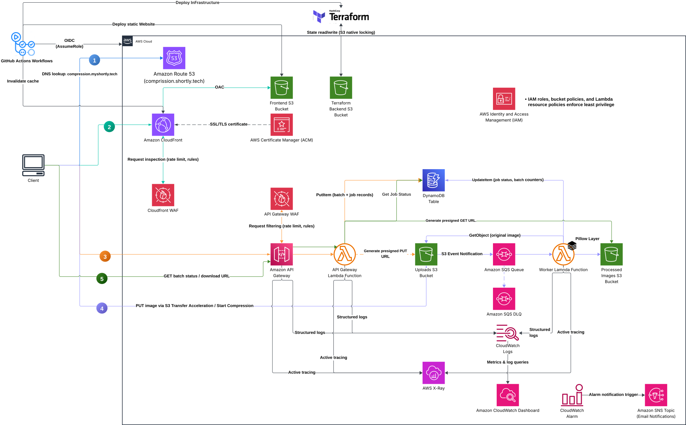
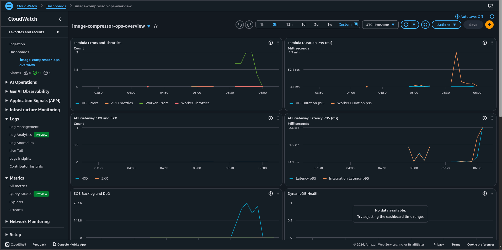
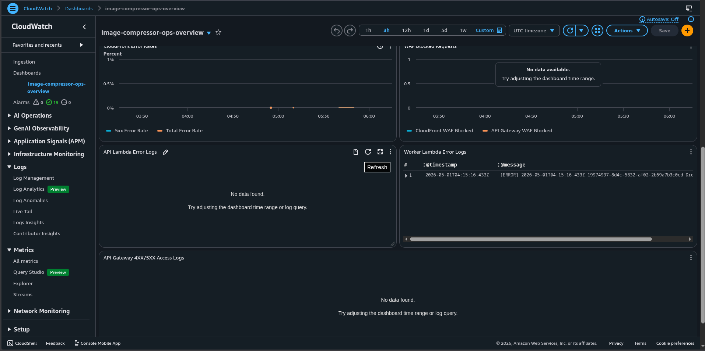
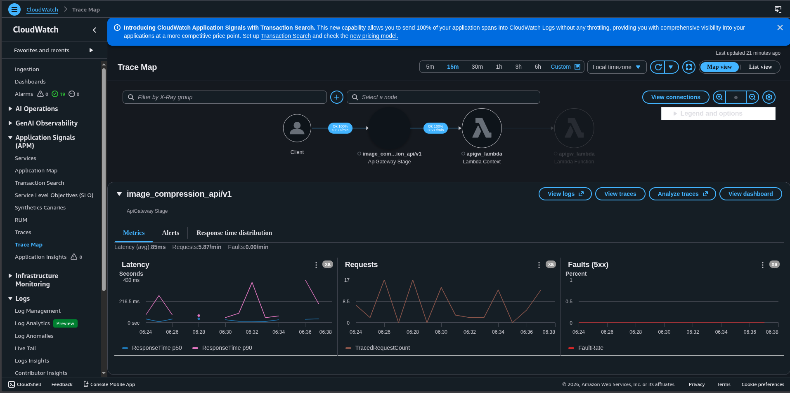
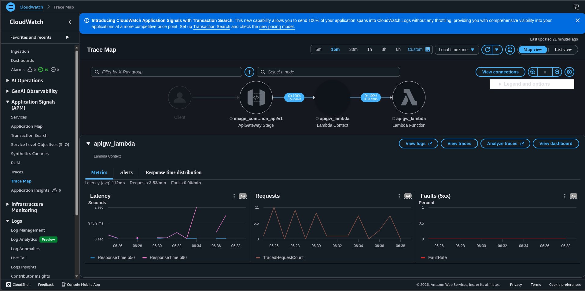
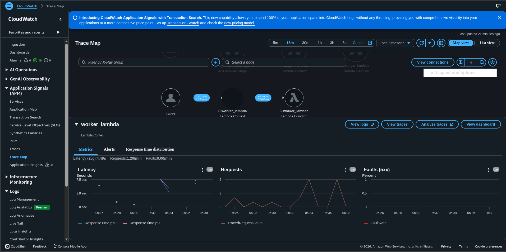
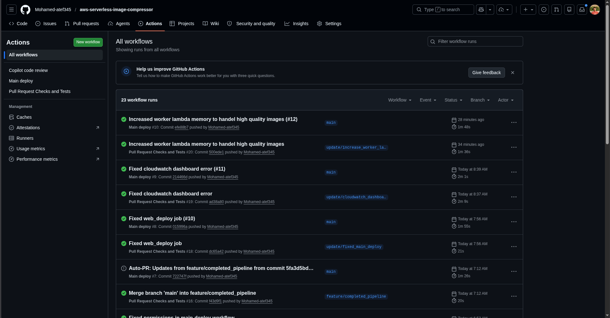

# ImageCompress - AWS Serverless Image Compression Platform

ImageCompress is a serverless image compression platform on AWS. Users upload images from a React frontend, API Gateway issues presigned upload URLs, and an asynchronous S3 -> SQS -> Lambda worker pipeline compresses images and tracks progress in DynamoDB.

- [Architecture Diagram](#architecture-diagram)
- [Architecture Overview](#architecture-overview)
- [See it in Action](#see-it-in-action)
- [Technology Stack](#technology-stack)
- [Repository Structure](#repository-structure)
- [Infrastructure Modules](#infrastructure-modules)
- [API Endpoints](#api-endpoints)
- [Processing Flow](#processing-flow)
- [Frontend](#frontend)
- [DevOps and CI/CD](#devops-and-cicd)
- [Security](#security)
- [Project Status](#project-status)
- [Getting Started](#getting-started)
- [Environment Variables](#environment-variables)

## Architecture Diagram

<p align="center">
  
</p>

High-level architecture. Some secondary follow-up browser requests, such as the final presigned download from the processed S3 bucket, are omitted in the diagram for readability.

## Architecture Overview

This project uses a serverless AWS architecture with direct-to-S3 uploads, asynchronous image processing, and operational monitoring.

### Runtime Flow

1. The browser resolves `compression.myshortly.tech` through Route 53 and fetches the React frontend from CloudFront, which uses an S3 bucket as its origin through Origin Access Control (OAC).
2. Frontend API requests go directly to API Gateway, protected by a regional AWS WAF. API Gateway invokes the Python API Lambda using `AWS_PROXY` integrations.
3. `POST /upload-url` creates batch and job records in DynamoDB, then returns presigned upload URLs for the uploads S3 bucket. The uploads bucket has S3 Transfer Acceleration enabled.
4. The browser uploads images directly to the uploads bucket using those presigned URLs instead of sending file payloads through API Gateway.
5. S3 `ObjectCreated` notifications send messages to the main SQS queue.
6. The worker Lambda, which includes a Pillow Lambda layer, consumes SQS messages in batches, downloads the original image from the uploads bucket, compresses or transcodes it, stores the result in the processed bucket, and updates DynamoDB job and batch status.
7. Failed SQS messages are retried and eventually moved to the DLQ according to the redrive policy.
8. The browser polls batch or job status through API Gateway. When processing is complete, the API Lambda returns a presigned download URL for a single output file or creates a ZIP in the processed bucket and returns a presigned URL for that archive.

### Core Services

- **Frontend delivery**: Route 53, ACM, CloudFront, CloudFront WAF, and the frontend S3 bucket.
- **API layer**: API Gateway, API Gateway WAF, and the API Lambda.
- **Async processing**: uploads S3 bucket, SQS queue, SQS DLQ, worker Lambda, and Pillow Lambda layer.
- **Data and storage**: DynamoDB for job and batch metadata, plus separate uploads and processed S3 buckets.
- **Observability**: CloudWatch Logs, CloudWatch Dashboard, CloudWatch Alarms, SNS email notifications, and X-Ray tracing.
- **Delivery and IaC**: GitHub Actions, Terraform, and the Terraform backend S3 bucket with lockfile-based state locking.

## See it in Action

### Single Image Upload & Compression

https://github.com/user-attachments/assets/daaf69b0-8d33-482f-82a9-469b751a11c0

### Batch Upload & Compression

https://github.com/user-attachments/assets/f3afed4b-f6d9-48fb-8d16-e328ed0207c6

### CloudWatch Ops Dashboard

<p align="center">
  
  <br/>
  
</p>

### AWS X-Ray Trace Map

<p align="center">
  
  <br/>
  
  <br/>
  
</p>

### CI/CD Pipeline

<p align="center">
  
</p>

## Technology Stack

| Layer         | Technology                                                                      |
| ------------- | ------------------------------------------------------------------------------- |
| Frontend      | React 19, Vite 6, TypeScript, TailwindCSS 3                                     |
| CDN           | CloudFront (OAC), Route 53, ACM                                                 |
| API           | API Gateway (REST, Regional)                                                    |
| API Lambda    | Python 3.14, boto3                                                              |
| Worker Lambda | Python 3.14, Pillow (Lambda Layer), boto3                                       |
| Queue         | SQS Standard, Dead Letter Queue                                                 |
| Database      | DynamoDB (single-table with `PK`/`SK`, `batch_id-index`, TTL)                   |
| Storage       | S3 buckets for frontend, uploads (Transfer Acceleration), and compressed output |
| IaC           | Terraform 1.x, AWS Provider 6.39                                                |
| CI/CD         | GitHub Actions (PR checks + main deploy via OIDC)                               |
| Observability | CloudWatch logs/alarms/dashboard + SNS alerts + X-Ray tracing                   |

## Repository Structure

```
image_compressor/
├── .github/
│   └── workflows/
│       ├── main-deploy.yml               # Main branch deploy pipeline
│       └── pr-checks.yml                 # PR checks and auto-PR workflow
├── apps/
│   └── web/                              # React + Vite frontend
│       ├── public/
│       ├── src/
│       │   ├── api/                      # API client layer
│       │   ├── components/               # UI sections and upload components
│       │   ├── test/                     # Test helpers and setup
│       │   └── __tests__/                # Frontend and API tests
│       ├── package.json
│       └── vite.config.ts
├── assets/
│   ├── Cloud_Architecture.svg            # Architecture diagram
│   ├── cloudwatch/                       # Dashboard screenshots
│   ├── demos/                            # Demo videos
│   ├── pipeline/                         # CI/CD screenshots
│   └── x-ray/                            # X-Ray screenshots
├── codes/
│   ├── apigw_lambda/
│   │   └── handler.py                    # API Lambda handler
│   └── worker_lambda/
│       └── handler.py                    # Worker Lambda handler
├── infrastructure/
│   └── terraform/
│       ├── main.tf                       # Root Terraform composition
│       ├── variables.tf
│       ├── outputs.tf
│       └── modules/
│           ├── S3_buckets/
│           ├── acm/
│           ├── api gateway/
│           ├── cdn/
│           ├── cloudwatch_dashboard/
│           ├── dynamodb/
│           ├── iam/
│           ├── lambda/
│           ├── route 53/
│           ├── sns/
│           ├── sqs/
│           ├── vpc/                      # currently commented in root
│           └── waf/
├── .gitignore
└── README.md
```

Ignored and generated directories such as `docs/`, `layer/`, `node_modules/`, `dist/`, and Terraform local state artifacts are intentionally omitted here.

## Infrastructure Modules

### Implemented Modules

| Module                 | Description                                                                        | Key Resources                                                                                        |
| ---------------------- | ---------------------------------------------------------------------------------- | ---------------------------------------------------------------------------------------------------- |
| `S3_buckets`           | Frontend, uploads, and processed buckets with encryption/versioning/CORS/lifecycle | `aws_s3_bucket`, versioning, SSE, CORS, lifecycle rules, Transfer Acceleration, upload notifications |
| `cdn`                  | CloudFront distribution with OAC, HTTPS redirect, custom 404 behavior              | `aws_cloudfront_distribution`, `aws_cloudfront_origin_access_control`                                |
| `acm`                  | DNS-validated certificate for root and wildcard domain                             | `aws_acm_certificate`, validation records                                                            |
| `route 53`             | Alias routing from subdomain to CloudFront                                         | Route53 record set                                                                                   |
| `dynamodb`             | Job and batch metadata table with GSI and TTL                                      | `aws_dynamodb_table`                                                                                 |
| `api gateway`          | REST resources, methods, integrations, deployment and stage                        | API Gateway resources/methods/integrations/stage                                                     |
| `iam`                  | Least-privilege IAM for API and worker Lambdas + CloudFront to S3 policy           | IAM roles, policies, attachments                                                                     |
| `lambda`               | API Lambda and worker Lambda packaging/deployment                                  | `aws_lambda_function`, event source mapping, layer association                                       |
| `sns`                  | Ops alerts topic and email subscription                                            | `aws_sns_topic`, `aws_sns_topic_subscription`                                                        |
| `sqs`                  | Main queue, DLQ, redrive policies, and S3 send-message policy                      | `aws_sqs_queue`, queue policy, redrive policy                                                        |
| `waf`                  | WAFv2 ACLs for CloudFront and API Gateway + associations/metrics                   | `aws_wafv2_web_acl`, `aws_wafv2_web_acl_association`                                                 |
| `cloudwatch_dashboard` | Unified ops dashboard for metrics and logs                                         | `aws_cloudwatch_dashboard`                                                                           |

### Partially Implemented / Pending

| Module | Current State           | What Remains                                       |
| ------ | ----------------------- | -------------------------------------------------- |
| `vpc`  | Implemented module code | Enable in root when private networking is required |

### Root Composition Notes

- Active modules in root `infrastructure/terraform/main.tf`: `dynamodb`, `s3_buckets`, `cdn`, `route53`, `acm`, `iam`, `api_gateway`, `lambda`, `sqs`, `sns`, `waf`, `cloudwatch_dashboard`.
- API Gateway invoke permissions are wired via `aws_lambda_permission` in root.
- Worker Lambda consumes SQS with `batch_size = 5`, `maximum_batching_window_in_seconds = 2`, and `ReportBatchItemFailures`.
- CloudWatch alarms are wired to SNS (`ops_alerts`) for email notifications.
- VPC module remains disabled in root for current deployment mode.
- Terraform remote state is configured with an S3 backend and lockfile (`use_lockfile = true`).

## API Endpoints

| Method | Endpoint                      | Description                                             |
| ------ | ----------------------------- | ------------------------------------------------------- |
| `POST` | `/upload-url`                 | Creates a batch and jobs; returns presigned upload URLs |
| `GET`  | `/jobs/{jobId}`               | Returns one job status                                  |
| `GET`  | `/batches/{batchId}`          | Returns aggregate batch status                          |
| `GET`  | `/batches/{batchId}/download` | Returns single file or zip download URL                 |

Notes:

- API integrations use `AWS_PROXY`.
- CORS preflight `OPTIONS` routes use `MOCK` integrations.
- Upload guardrails: max `5` files per batch, max `10 MB` per file, and max `30 MB` total batch size.

## Processing Flow

1. Client calls `POST /upload-url`.
2. API Lambda creates DynamoDB records and returns presigned S3 upload URLs (using S3 Transfer Acceleration endpoint for faster uploads).
3. Client uploads directly to S3 uploads bucket via the accelerated endpoint.
4. S3 `ObjectCreated` event is sent to SQS.
5. Worker Lambda reads SQS records, fetches source objects from S3, compresses/transcodes images, writes output to processed bucket using `<original_name>_compressed.<ext>` naming, and updates DynamoDB job/batch state.
6. Client polls `GET /batches/{batchId}` and optionally `GET /jobs/{jobId}`.
7. On completion, client requests `GET /batches/{batchId}/download`.

Worker configuration:

- SQS batch size: 5
- Batching window: 2 seconds
- Lambda timeout: 120 seconds
- Worker Lambda memory: 1024 MB
- SQS visibility timeout: 120 seconds
- Max receive count: 3 (to DLQ)
- Partial batch response: enabled via `ReportBatchItemFailures`

## Frontend

Frontend is implemented in `apps/web` as a React single-page app.

Implemented features:

- Presigned upload flow integration with API and S3 (via Transfer Acceleration).
- Batch/job polling and progress visualization.
- Compression options exposed to user (`format`, `quality`, `max_width`).
- Upload validation guardrails in the client (max `5` files, `10 MB` per file, `30 MB` batch total).
- Premium settings panel redesign for format, quality, and max-width controls with explanatory labels.
- Download flow for single-image and multi-image outputs, including forced browser download behavior.
- **UI locking during uploads**: drop zone, file input, "+ Add more" button, file removal buttons, and all settings dropdowns are disabled while an upload/processing operation is in progress to prevent race conditions.
- **Processing overlay via React Portal**: the compression progress overlay renders through `createPortal` into `document.body`, ensuring it always appears above all page content regardless of parent z-index stacking contexts.
- Frontend unit tests with Vitest and Testing Library (`npm run test:ci`).

## DevOps and CI/CD

Implemented DevOps features:

- **Terraform architecture**: modular IaC in `infrastructure/terraform/modules` for `S3_buckets`, `cdn`, `acm`, `route 53`, `dynamodb`, `api gateway`, `iam`, `lambda`, `sqs`, `sns`, `waf`, `cloudwatch_dashboard`, and a currently disabled `vpc` module.
- **State management**: remote Terraform state via S3 backend with lockfile locking enabled (`use_lockfile = true`).
- **Edge + DNS delivery**: CloudFront distribution with OAC, ACM certificate validation, and Route53 alias record to `compression.<domain>`.
- **Storage setup**: dedicated frontend/uploads/processed S3 buckets with SSE (`AES256`), CORS rules restricted to `compression.myshortly.tech`, S3 event notifications from uploads bucket to SQS, **S3 Transfer Acceleration** enabled on the uploads bucket for faster global uploads, and **lifecycle rules** (uploads auto-deleted after 1 day, compressed files auto-deleted after 7 days).
- **Async processing pipeline**: SQS main queue + DLQ + redrive policy, then worker Lambda event source mapping with `batch_size = 5`, `maximum_batching_window_in_seconds = 2`, and `ReportBatchItemFailures`.
- **Lambda packaging/runtime**: API and worker functions are packaged with Terraform `archive_file`; worker uses a Pillow Lambda layer zip and runs with `python3.14`, `120s` timeout, and `1024 MB` memory.
- **IAM least privilege**: separate API/worker Lambda roles with scoped S3, DynamoDB, SQS, and CloudWatch Logs permissions; worker role also includes X-Ray publish permissions.
- **API deployment plumbing**: API Gateway REST resources/methods/integrations/stage are provisioned in Terraform with Lambda invoke permissions from API Gateway.
- **Edge and API protection**: WAFv2 ACLs are attached to both CloudFront and API Gateway with managed rule groups and rate limiting.
- **Observability baseline**: X-Ray active tracing is enabled for API Gateway and both Lambdas.
- **CloudWatch monitoring**: log groups with retention, service alarms (Lambda, API Gateway, SQS/DLQ, DynamoDB, CloudFront, WAF), SNS alert routing, and a centralized CloudWatch dashboard module.

### CI/CD Pipelines

Fully implemented GitHub Actions workflows:

- **PR Checks** (`.github/workflows/pr-checks.yml`): Triggers on push to any branch except `main`. Uses `dorny/paths-filter` to detect changes and conditionally runs:
  - **Frontend tests**: installs dependencies and runs `npm run test:ci` (Vitest).
  - **Lambda code checks**: syntax-checks Python code via `compileall` in a Docker container.
  - **Infrastructure tests**: authenticates via OIDC, builds the Pillow Lambda layer, runs `terraform init`, `fmt -check`, `validate`, and `plan`.
  - **Auto PR + merge**: if all checks pass, automatically creates a PR (if missing) and enables squash auto-merge.
  - Concurrency control cancels in-progress runs on the same branch.

- **Main Deploy** (`.github/workflows/main-deploy.yml`): Triggers on push to `main` or via manual `workflow_dispatch`. Authenticates via OIDC, builds the Pillow Lambda layer, runs `terraform apply -auto-approve`, exports Terraform outputs (API URL, bucket name, CloudFront distribution ID) as job outputs, saves all outputs as a downloadable JSON artifact, then builds and deploys the frontend to S3 with CloudFront cache invalidation. The `VITE_API_BASE_URL` is automatically injected from Terraform output at build time.

## Security

Implemented:

- Private S3 buckets with server-side encryption.
- CloudFront OAC with signed origin requests.
- IAM least-privilege roles for API and worker Lambda functions.
- Presigned upload/download architecture (no image payload through API Gateway).
- WAFv2 attached to CloudFront and API Gateway.
- CloudWatch + SNS alerting pipeline for operational events.
- CORS origins restricted to production domain (`compression.myshortly.tech`).
- S3 lifecycle rules to auto-delete temporary files (uploads: 1 day, compressed: 7 days).

## Project Status

### Completed

- API Lambda module and handler (with dual S3 clients: standard for downloads, accelerated for uploads).
- SQS module including DLQ and S3 notification policy.
- Worker Lambda module wiring (runtime, environment variables, SQS event source mapping).
- Worker Lambda handler implementation in `codes/worker_lambda/handler.py`.
- Worker IAM role/policy wiring.
- CloudFront + ACM + Route53 infrastructure wiring for frontend delivery.
- WAFv2 implementation and association for both CloudFront and API Gateway.
- CloudWatch alarms across Lambda, API Gateway, SQS/DLQ, DynamoDB, CloudFront, and WAF.
- SNS ops topic + email subscription integration for alarm notifications.
- Centralized CloudWatch dashboard module for metrics and logs widgets.
- Terraform remote state backend configuration with locking.
- Core frontend upload and processing UX.
- S3 Transfer Acceleration enabled on uploads bucket.
- S3 lifecycle rules for automatic file cleanup.
- CORS origins restricted to production domain.
- CI/CD pipelines: PR checks workflow and main deploy workflow (with frontend build + deploy).
- Frontend UI locking during active uploads/processing.
- Processing overlay rendered via React Portal for correct z-index layering.
- Frontend unit tests with Vitest.

## Getting Started

### Prerequisites

- Terraform >= 1.14
- AWS CLI configured with appropriate credentials
- Node.js >= 18 (or Bun)
- Python 3.14
- Docker (required to build Lambda-compatible Pillow layer)

### 1) Clone

```bash
git clone https://github.com/Mohamed-atef345/aws-serverless-image-compressor.git
cd aws-serverless-image-compressor
```

### 2) Build Pillow Lambda Layer

Run from repository root:

```bash
mkdir -p layer/python
docker run --rm -v "$PWD/layer:/var/task/layer" public.ecr.aws/sam/build-python3.14:latest \
  /bin/sh -c "pip install --no-cache-dir pillow -t /var/task/layer/python"
(cd layer && zip -r ../infrastructure/terraform/modules/lambda/pillow_layer.zip python)
```

### 3) Deploy Infrastructure

```bash
cd infrastructure/terraform
terraform init
terraform plan
terraform apply
```

After apply, you can print the dashboard name for pipeline/ops usage:

```bash
terraform output cloudwatch_dashboard_name
```

### 4) Run Frontend Locally

```bash
cd apps/web
npm install
npm run dev
```

## Environment Variables

### Terraform Inputs (selected)

| Variable                    | Default                              |
| --------------------------- | ------------------------------------ |
| `aws_region`                | `us-east-1`                          |
| `frontend_bucket_name`      | `image-compression-frontend-bucket`  |
| `uploads_bucket_name`       | `image-compression-uploads-bucket`   |
| `processed_bucket_name`     | `image-compression-processed-bucket` |
| `table_name`                | `imageCompressionMetadata`           |
| `message_retention_seconds` | `10800`                              |
| `maxReceiveCount`           | `3`                                  |
| `admin_email`               | no default (required)                |
| `cloudwatch_dashboard_name` | `image-compressor-ops-overview`      |

### API Lambda Environment

| Variable               | Purpose                                                   |
| ---------------------- | --------------------------------------------------------- |
| `DYNAMODB_TABLE`       | DynamoDB table for jobs and batches                       |
| `UPLOADS_BUCKET`       | Upload bucket for presigned PUT URLs                      |
| `COMPRESSED_BUCKET`    | Output bucket for presigned download URLs                 |
| `PRESIGNED_URL_TTL`    | Presigned URL expiration in seconds                       |
| `MAX_FILE_SIZE_BYTES`  | Max allowed size for a single upload (default 10 MB)      |
| `MAX_BATCH_SIZE_BYTES` | Max allowed size for all files in a batch (default 30 MB) |
| `MAX_BATCH_FILES`      | Max files per batch (configured as `5`)                   |

### Frontend Environment

| Variable            | Purpose                                     |
| ------------------- | ------------------------------------------- |
| `VITE_API_BASE_URL` | Base URL for API requests from the web app. |

### Worker Lambda Environment

| Variable                | Purpose                                  |
| ----------------------- | ---------------------------------------- |
| `DYNAMODB_TABLE`        | DynamoDB table for job and batch updates |
| `COMPRESSED_BUCKET`     | Destination bucket for compressed files  |
| `DEFAULT_OUTPUT_FORMAT` | Fallback output format (`WEBP`)          |
| `DEFAULT_QUALITY`       | Fallback quality setting (`80`)          |
